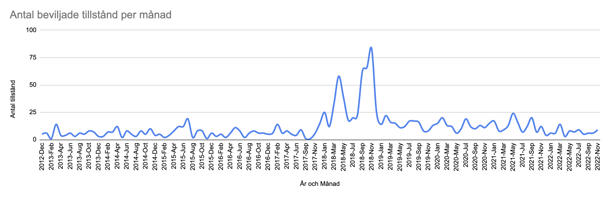

# Öppna tillståndsregister

This python script can automatically fetch all items in the [register](https://www.mprt.se/tillstandsregister/) (*tillståndsregister*) of the Swedish Press and Broadcasting Authority (*Myndigheten för press, radio och tv*). It exports the result as JSON or CSV.

On this repository, you can download the data directly. It is updated by Github Actions on the first day of each month at 1AM CET. The data is updated continuously by the authority so the data made available by this hobby project might be outdated, or inaccurate.

License for the code is AGPL 3.0, license for the data is CC0 (but attribution is appreciated).

## Why?

This list contains a list of organisations getting a special authorisation from the authority to broadcast and to store and process personal data.

Maybe more interesting for me is the latter since organisations getting an authorisation (*utgivningsbevis*) get a joker to skip their obligations regarding GDPR that (to my knowledge) no other country delivers in the EU. It's a cornestone to the fundamentally broken market of personal data that Sweden has become where state agencies sell their citizens' data and where commercial data brokers gather a huge amount of sensitive data on most of the Swedish population without any form of oversight since the privacy authority (*Integritetsskyddsmyndigheten*) is powerless against *utgivningsbevis*.

In a report published in 2019, its anscestor *Datainspektionen* was remarking that a record was broken in the number of authorisations delivered in the months surrounding GDPR and was expressing doubts over the fact that all these organisations should be given an authorisation. According to the most recent data I pulled (November 2022), the number of authorisations delivered since 2019 is superior to the record year 2018 and to all years before combined (2003-2017).



## Installation

- Install Python 3 on your machine if you don't already have it.

- Install the dependencies

```python
pip install -r requirements.txt
```

## Usage

- Import ***mprt*** and use one of its functions

```python
import mprt

# Getting the whole register
register = register = mprt.get_all_pages()
